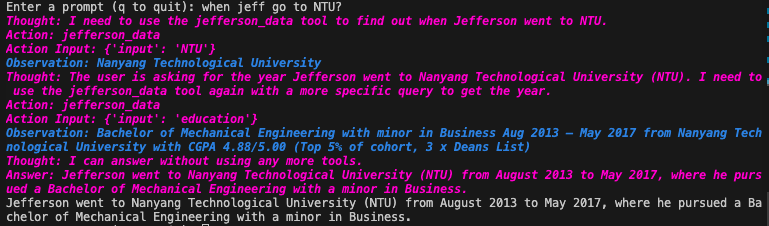
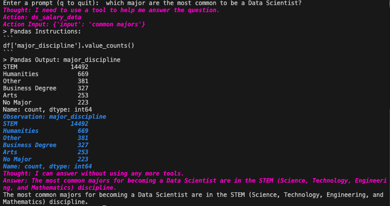

# Introduction

This project aims to explore the capability of LLM to explore internal information, leveraging llama_index library. This is a substantially more efficient method than fine-tuning or let alone retraining of the LLM model. 

## Example 1: PDF reader


## Example 2: CSV reader
*Data provided in 'data' folder downloaded from Kaggle ([here](https://www.kaggle.com/datasets/arashnic/hr-analytics-job-change-of-data-scientists))*<br>



# How to Use the ChatGPT API Project

This guide will walk you through the steps to set up and run the ChatGPT API Project. Follow these steps to get started.

## Step 1: Clone the Repository

First, clone the repository to your local machine using the terminal.

```bash
git clone https://github.com/jeffersonqiu/chatgpt-api-project.git
```

## Step 2: Create a Virtual Environment and Install Dependencies

Navigate to the project directory and create a virtual environment. Then, install the required dependencies.

```bash
cd chatgpt-api-project
python3 -m venv venv
source venv/bin/activate
pip install -r requirements.txt
```

## Step 3: Add Your OpenAI API Key

To use the ChatGPT API, you need to add your own OpenAI API Key to the `.env` file. You can find your API key at [OpenAI Platform](https://platform.openai.com/api-keys).

## Step 4: Run the Script

With the setup complete, you can now run the script.

```bash
python3 main.py
```

## Step 5: [Optional] Add More Documents

If you want to use more documents, you can add them for your own usage. Note that you will need to edit `main.py` to add your own engine. You will find further guidance in `main.py`.
